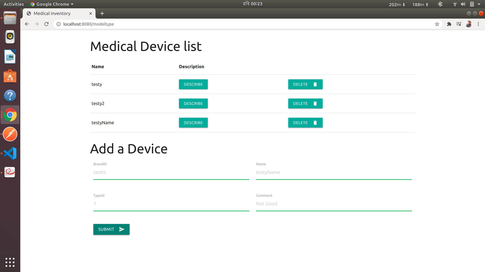

# Medical-Inventory
> Note: Completed this task within 2 days. I had office previous 3 days.

> Another Note: I learnt vue, typescript within the 1st day and implemented most of the project within the 2nd day.

This is a Typescript project using VueJS. Majority of the code is done in Typescript. Run the following code to see if node.js is installed: 

```bash
node --version
```
If node.js is not installed, first install it. Then continue with the following code:

```bash
npm run dev
```
This should start the server at http://localhost:8080.

Some ScreenShots of the project:

ModelType shows the list of medical devices at /modeltype


Clicking on description brings the description of the name, all information like BrandId, Name, TypeID, Comment


Clicking on delete deletes the particular entry


Deleted successfully is shown in this figure.


Adding a device to the medical device list is shown here.


Successful addition of the device.


> Note: I could not implement login since I only had 2 days free time. Most of the backend api components implemented successfully.

